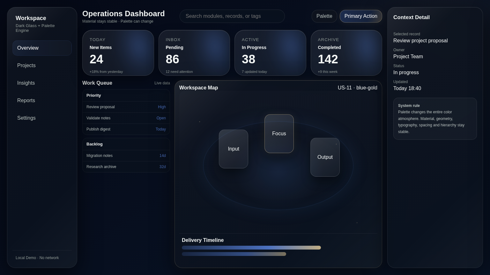

# Prism Glass / 棱镜玻璃

Prism Glass is an open-source UI Design Skill for coding agents. It separates stable dark-glass material DNA from a configurable Palette Engine. Glass depth, typography, spacing, geometry and hierarchy remain consistent while canvas, ambient light, surface tint, accents, highlights and data visualization can be recolored as one coherent system.

## Features

- Dark glass design language
- Semantic design tokens
- 16 built-in descriptive palettes (US-00 ~ US-15)
- Whole-UI recoloring instead of accent-only switching
- Five-color custom palettes
- Adjustable palette intensity, ambient strength, surface tint and accent usage
- Optional blue-gold compound effects for US-11
- Flexible dashboard/content layouts
- Responsive rules
- Runnable canonical demo and screenshot-based QA
- Optional `fluidglass-ui` integration

Teal-green is only one preset, not a fixed brand color.

## Quick start

1. Put the directory in your Agent Skill directory.
2. Ask the Agent to read `SKILL.md` and `references/palette-presets.json`.
3. Specify a preset such as `US-11 blue-gold`, or provide five custom brand colors.
4. Validate the result with `ACCEPTANCE_CHECKLIST.md`.

## Author

**清晨方白晓** · `csuyincs-creator`

中南工科研究生 · 非 AI 从业者，热衷探索 AI 落地实践与 Vibe Coding，持续记录分享好玩的东西。

- 公众号 🔍：清晨方白晓
- 小红书 / 抖音 同号：清晨方白晓

See `LICENSE` and `NOTICE` for licensing details.
