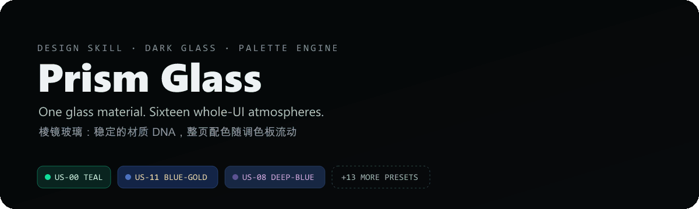

  

<h1 align="center">Prism Glass / 棱镜玻璃</h1>

  
  
  

<a href="README.md">English</a> · <strong>简体中文</strong>

**面向 Coding Agent 的开源深色玻璃 UI Design Skill。** 玻璃材质、层级、字体、间距、圆角与信息结构保持一致，而页面背景、环境光、玻璃染色、强调色、高光和图表颜色作为一套系统整体切换——一次换色，整页氛围随之流动。

## 实机演示

## 核心理念

> **玻璃材质是稳定的，调色板改变的是氛围。**
> 青绿色（teal-green）只是 16 个预设里的其中一个，**不是 Skill 的固定品牌色**。切换 Palette 时应重新着色整个 UI（背景、环境光、玻璃染色、强调色、高光、图表），而不是只改按钮颜色。

## 核心能力

- 深色玻璃（Dark Glass）视觉设计语言，质感统一、层级清晰
- 语义化 Design Token，便于二次开发与主题扩展
- 16 套内置描述型 Palette（US-00 ~ US-15）
- 整页换色：Canvas / Ambient / Surface / Accent / Highlight / Data Viz 作为一套系统联动
- 5 色自定义 Palette，适配品牌色
- 色彩强度、环境光、玻璃染色、强调色占比均可微调
- `US-11 blue-gold` 蓝金交织复合效果
- 灵活的 Dashboard / 内容页布局
- 响应式 UI 规则
- Canonical Demo 与截图验收规范，可量化核对
- 可选 `fluidglass-ui` 实时流体玻璃增强

## 内置调色板一览

每个预设恰好五个原始色：**C1 锚点 · C2 主色 · C3 强调 · C4 柔和 · C5 高光**。完整数据见 [`references/palette-presets.json`](references/palette-presets.json)。

| ID | 名称 | C1 锚点 | C2 主色 | C3 强调 | C4 柔和 | C5 高光 |
| --- | --- | --- | --- | --- | --- | --- |
| US-00 | 青绿深色系 | `#02100D` | `#0B3A30` | `#10DF9A` | `#66CDB1` | `#C8F5E8` |
| US-01 | 冷蓝粉系 | `#3A6E8E` | `#6E9EAE` | `#B4C8D8` | `#E0C8D4` | `#F2C8D0` |
| US-02 | 紫金暖调系 | `#3E2564` | `#7B5E8E` | `#B898A0` | `#D4B896` | `#E5C87B` |
| US-03 | 蓝橙柔和系 | `#1E3E6E` | `#5A6E9E` | `#9E8EAA` | `#D49E8A` | `#F0B878` |
| US-04 | 杏粉浅暖系 | `#E8A890` | `#EDC8B8` | `#F2D8C8` | `#F5E8D0` | `#F9F0E0` |
| US-05 | 青紫渐变系 | `#1A3A3A` | `#2E6E6E` | `#5A8E9E` | `#8E6E9E` | `#B888C4` |
| US-06 | 薄荷浅绿系 | `#5A9E8E` | `#8EC8B8` | `#B8E0D4` | `#D8F0E8` | `#F2F8F0` |
| US-07 | 青灰中性系 | `#5A6E6E` | `#8A9E9E` | `#B4C4C4` | `#D4DCD8` | `#EEF0EE` |
| US-08 | 深蓝紫系 | `#0E1A3E` | `#2E3E6E` | `#5E4E8E` | `#9E7BBE` | `#D0A8E0` |
| US-09 | 深色中性系 | `#080A0D` | `#11151A` | `#20262D` | `#424B55` | `#AEB6BF` |
| US-10 | 浅色中性系 | `#202327` | `#666D75` | `#BCC2C8` | `#ECEFF1` | `#FAFBFC` |
| US-11 | 蓝金交织系 | `#0A1335` | `#163B7A` | `#4B70BE` | `#C89A55` | `#F2D79E` |
| US-12 | 湖蓝晨光系 | `#1E3E4A` | `#3A6E7E` | `#6EA0AE` | `#A8D0D8` | `#E2EEF0` |
| US-13 | 冰蓝系 | `#2A3E4E` | `#4A6E8E` | `#8EAEC8` | `#C8DCE8` | `#EEF4F8` |
| US-14 | 岩绿中性系 | `#2A2A2E` | `#4A4A4E` | `#7A7A78` | `#A8B0A0` | `#D8E0D0` |
| US-15 | 森林绿系 | `#1E2E22` | `#2E4536` | `#4A6B52` | `#8AA890` | `#D8E8DC` |

## 快速开始

1. 把本目录放进你的 Agent Skill 目录。
2. 让 Agent 读取 `SKILL.md` 与 `references/palette-presets.json`。
3. 指定预设（如 `US-11 blue-gold`），或直接给出五个品牌色。
4. 用 `ACCEPTANCE_CHECKLIST.md` 验收结果。

## 作者

**清晨方白晓** · `csuyincs-creator` · 中南工科研究生，热衷探索 AI 落地实践与 Vibe Coding，持续记录分享好玩的东西。

- 公众号 🔍：清晨方白晓
- 小红书 / 抖音 同号：清晨方白晓

许可与声明见 [`LICENSE`](LICENSE) 与 [`NOTICE`](NOTICE)。
